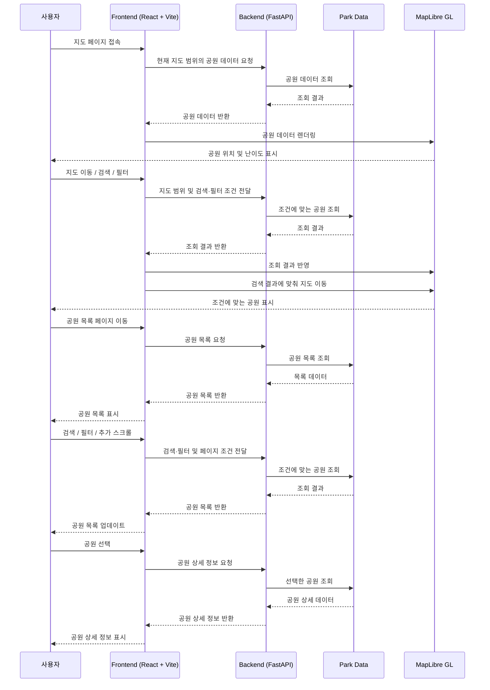

# 댕 신나개

반려동물과 함께 산책할 수 있는 서울시 공원 정보를 제공하고, 공원의 면적·고도·경사도 등을 기반으로 산책 난이도를 제공하는 지도 서비스

## 🚀 배포

### [Frontend - Vercel](https://dang-shin-na-gae.vercel.app)

### [Backend - Render](https://dang-shin-na-gae-api.onrender.com)

> **배포 환경 안내**  
> Backend는 Render 무료 인스턴스를 사용하고 있어 일정 시간 요청이 없으면 서버가 중지될 수 있다. 이 경우 첫 요청 시 서버가 다시 활성화되면서 응답이 지연될 수 있다.  
> 서버 활성화 이후에도 지도에 공원 마커가 표시되지 않는 경우 페이지를 새로고침하면 정상적으로 데이터를 불러올 수 있다.

## ▶️ 실행 방법

### Frontend

```bash
cd frontend
npm install
npm run dev
```

### Backend

```bash
python -m venv venv
pip install -r requirements.txt

cd backend
fastapi dev
```

## ⚙️ 기술

### Frontend


### Backend


### Data & Geospatial


### Deployment


## 💡 기획 배경

공공데이터를 직접 수집·가공하고 지도 위에 시각화하는 과정을 경험하기 위해 시작한 프로젝트이다. 서울시 공원 데이터와 공간 데이터를 전처리하고, 지도에 공원 위치와 정보를 표시하며 데이터 분석이 필요한 과정은 Python 기반의 백엔드와 데이터 처리 파이프라인으로 구현했다.

처음에는 대형견을 위한 산책 공원 추천 서비스를 기획했지만, 실제 데이터를 조사하면서 반려견 출입 여부를 명확하게 확인할 수 있는 공원이 제한적이라는 점을 확인했다. 이에 특정 견종이나 크기에 한정하지 않고, 반려동물과 산책할 공원을 찾는 데 도움이 되는 서비스로 범위를 확장했다.

## 📂 프로젝트 구조

```text
dang-shin-na-gae/
├── frontend/                    # React 기반 프론트엔드
├── backend/
│   └── app/                     # FastAPI 애플리케이션
│
├── scripts/                     # 데이터 처리 및 분석 스크립트
│   ├── pipeline/                # 공간 데이터 매칭·가공 파이프라인
│   ├── analysis/                # 데이터 분석 및 검증
│   ├── archive/                 # 이전 분석·처리 스크립트
│   ├── calculate_difficulty.py  # 산책 난이도 산정
│   ├── calculate_elevation.py   # 고도·경사 데이터 생성
│   ├── calculate_pet_status.py  # 반려동물 관련 데이터 가공
│   └── preprocess.py            # 서울시 공원 데이터 전처리
│
├── data/
│   ├── raw/                     # 원본 데이터
│   ├── processed/               # 전처리·공간정보 가공 데이터
│   └── features/                # 고도·난이도 등 파생 데이터
│
└── requirements.txt             # Python 의존성
```

## 📜 설계

### ⚙️ 기능 목록

1. **지도 탐색**
   - 서울시 공원 위치를 지도에 표시한다.
   - 산책 난이도에 따라 마커 색상을 구분한다.
   - 지도 이동 범위에 맞춰 공원 데이터를 조회한다.

2. **공원 검색**
   - 공원명을 기반으로 검색한다.
   - 검색 결과에 맞춰 지도 위치를 자동으로 이동한다.

3. **공원 필터**
   - 난이도, 지역, 반려동물 출입 여부에 따라 공원을 필터링한다.

4. **공원 목록**
   - 서울시 공원을 목록 형태로 제공한다.
   - 무한 스크롤 방식으로 데이터를 추가 조회한다.
   - 검색 및 필터 조건을 목록에 반영한다.

5. **공원 상세 정보**
   - 공원 면적, 평균 경사도, 고도차, 산책 난이도, 위치 등 상세 정보를 제공한다.

### 🗒️시퀀스 다이어그램



### 📃 API 문서

FastAPI에서 제공하는 Swagger UI를 통해 API 명세를 확인하고 직접 요청을 테스트할 수 있다.

### [Swagger UI](https://dang-shin-na-gae-api.onrender.com/docs)

> Backend는 Render 무료 인스턴스를 사용하고 있어 일정 시간 요청이 없으면 서버가 중지될 수 있다. 이 경우 첫 요청 시 서버가 다시 활성화되면서 응답이 지연될 수 있다.

## 🗺️ 데이터 구축

### 공원 데이터 수집 및 전처리

서울시 주요 공원현황 데이터를 기반으로 서비스와 후속 공간 분석에 사용할 공원 데이터를 구축했다.

원본 데이터에는 공원 기본 정보뿐만 아니라 개원일, 주요시설, 주요식물, 주소, 관리부서, 이미지, 이용 안내, GRS80TM/WGS84 좌표 등 다양한 정보가 포함되어 있어, 서비스에 필요한 데이터를 선별하고 분석 가능한 형태로 정제하는 과정을 거쳤다.

- 공원명, 면적, 주소, 지역, WGS84 위·경도 등 서비스 및 공간 분석에 필요한 컬럼을 선별
- 한글로 구성된 원본 컬럼명을 `name`, `area`, `lat`, `lon` 등 후속 처리에 사용하기 쉬운 형태로 정리
- 문자열 형태의 면적 데이터를 파싱하여 수치형 데이터로 변환
- WGS84 좌표를 수치형으로 변환하고, 위치 정보가 유효하지 않은 데이터를 확인 및 정리
- 전처리된 공원마다 고유 ID를 부여하여 이후 Polygon 매칭, 면적 보정, 고도 수집, 난이도 산정 단계에서 동일한 공원을 추적할 수 있도록 설정
- 전처리 결과를 `parks.csv`로 저장하고 이후 데이터 구축 파이프라인의 기준 데이터로 사용

전처리 이후에도 원본 데이터의 면적 누락 및 비정형 값을 별도로 검토하고, 공간 데이터 및 확인 가능한 자료와 비교하여 필요한 값을 보정했다.

### 공원 Polygon 매칭

처음에는 OSM 데이터만 활용해 공원 경계를 구축하려 했으나, 일부 공원에서 정확한 Polygon을 확보하기 어려워 서울시 공원 Polygon 데이터와 OSM 데이터를 함께 활용했다.

공원 좌표의 Polygon 포함 여부, 공원명 유사도, Polygon과의 거리 등을 기준으로 후보를 비교하고 신뢰도가 높은 경우 자동으로 매칭했다.

자동 매칭이 어려운 공원은 별도로 검토하고, 서울시 Polygon이 부정확하거나 누락된 경우 OSM Polygon으로 대체했다. 잘못된 Polygon을 제공하는 것보다 신뢰할 수 있는 데이터만 사용하는 것이 적절하다고 판단해 신뢰도가 낮은 Polygon은 제외했다.

자동 매칭 결과는 수동으로 검토해 잘못된 매칭을 보정했으며, 공간 데이터 자체의 한계로 정확한 경계를 확보하지 못한 일부 공원은 Polygon 정보에서 제외했다.

### 공원 면적 산정

공공데이터의 면적에는 일부 누락 및 이상값이 존재해 원본 값을 그대로 사용하지 않고 Polygon 기반 면적과 교차 검증했다.

Polygon 데이터는 면적 계산이 가능한 좌표계로 변환한 뒤 실제 면적을 계산하고, 원본 데이터와 비교해 이상값을 확인했다.

공공데이터의 면적 값이 비정상적이거나 Polygon만으로 정확한 면적을 산정하기 어려운 경우에는 공식 자료를 확인해 값을 수동으로 보정했다.

최종적으로 각 공원에 사용할 면적 값을 정리하고 산책 난이도 계산에 활용했다.

### 고도 데이터 수집

공원의 지형 특성을 난이도에 반영하기 위해 Google Elevation API를 활용해 고도 데이터를 수집했다.

공원 중심점의 고도만으로는 공원 내부의 높이 변화를 파악하기 어렵다고 판단해, 중심 좌표와 주변 여러 방향의 지점을 샘플링했다.

각 지점의 고도를 기반으로 평균 고도, 최소·최대 고도, 고도차를 계산하고, 샘플 지점 간 거리와 고도 차이를 이용해 평균 경사도를 산출했다.

또한 공원마다 규모가 다른 점을 고려해 샘플링 거리를 조정했고, 수집한 고도차와 평균 경사도는 산책 난이도 산정에 활용했다.

### 산책 난이도 산정

별도의 정답 난이도 데이터가 존재하지 않아 절대적인 난이도를 예측하는 방식보다, 공원의 지형 특성을 기반으로 상대적인 활동 강도를 비교하는 지표를 설계했다.

공원 면적, 고도차, 평균 경사도를 난이도 지표로 사용했으며, 면적과 고도차는 값의 편차가 큰 특성을 고려해 `log1p` 변환을 적용했다. 이후 각 지표를 `MinMaxScaler`로 정규화해 서로 다른 단위와 범위를 동일한 척도로 변환했다.

경사도는 이동 시 체감되는 활동 강도에 직접적인 영향을 준다고 판단해 가장 높은 가중치를 적용했다.

- 공원 면적: 30%
- 고도차: 30%
- 평균 경사도: 40%

가중치를 적용한 최종 점수에 따라 난이도를 `Easy`, `Medium`, `Hard`, `Expert` 4단계로 구분했다.

- `Easy`: 0.25 미만
- `Medium`: 0.25 이상 0.5 미만
- `Hard`: 0.5 이상 0.75 미만
- `Expert`: 0.75 이상

산책 난이도는 특정 반려견의 적합성을 판단하는 기준이 아니라, 공원의 지형 특성과 활동 강도를 비교하기 위한 상대적인 지표로 사용했다.

## 🖥️ 화면 및 기능

### 지도

서울시 공원 위치를 MapLibre 기반 지도에서 확인할 수 있다.

공원별 산책 난이도를 `Easy`, `Medium`, `Hard`, `Expert`로 구분하고 난이도에 따라 마커 색상을 다르게 표시했다. 지도를 이동하면 현재 화면 영역을 기준으로 공원 데이터를 다시 조회해 해당 범위의 공원을 표시한다.

공원을 선택하면 해당 공원의 위치와 기본 정보를 확인할 수 있으며, 검색 및 필터 조건에 따라 지도에 표시되는 공원을 변경할 수 있다.

### 공원 검색

공원명을 기준으로 원하는 공원을 검색할 수 있다.

검색어 입력 시 debounce를 적용해 입력마다 불필요한 요청이 발생하지 않도록 했으며, 검색 결과가 존재하면 해당 공원들을 확인할 수 있도록 지도 영역을 자동으로 조정한다.

검색 결과가 하나인 경우 해당 공원으로 이동하고, 여러 개인 경우 검색된 공원들을 한 화면에서 확인할 수 있도록 지도 범위를 조정한다.

### 공원 필터

산책 난이도, 지역, 반려동물 출입 여부를 기준으로 원하는 공원을 필터링할 수 있다.

선택한 조건은 지도와 공원 목록의 조회 조건에 각각 반영되며, 현재 적용 중인 필터를 확인하고 개별적으로 해제할 수 있다.

### 공원 목록

서울시 공원을 목록 형태로 탐색할 수 있다.

한 번에 전체 데이터를 불러오지 않고 페이지 단위로 조회하며, 사용자가 목록 하단에 도달하면 다음 데이터를 요청하는 무한 스크롤 방식을 적용했다.

공원명 검색과 난이도, 지역, 반려동물 출입 여부 필터를 함께 사용할 수 있으며 조건이 변경되면 해당 조건을 기준으로 목록을 다시 조회한다.

### 공원 상세

선택한 공원의 위치와 기본 정보뿐만 아니라 데이터 분석을 통해 생성한 면적, 평균 경사도, 고도차, 산책 난이도를 확인할 수 있다.

공원 목록에서 공원을 선택하면 해당 공원의 상세 데이터를 API를 통해 조회해 표시한다.

## 🛠️ 성능 최적화 및 문제 해결

### 1. 지도 마커 렌더링 최적화

**문제**

지도는 이동과 확대·축소 과정에서 화면이 지속적으로 갱신되며, 초기 구현에서는 각 공원을 MapLibre의 `Marker`를 이용해 개별 DOM 요소로 렌더링하고 있었다. 현재 132개의 공원에서는 원활하게 동작했지만, 데이터 증가에 따른 렌더링 비용을 고려해 렌더링 방식을 검토했다.

**원인**

DOM Marker는 공원마다 개별 DOM 요소를 생성하고 관리하기 때문에 데이터가 증가할수록 브라우저가 처리해야 하는 DOM 요소도 함께 증가한다.

**해결**

개별 DOM 요소 대신 MapLibre의 렌더링 파이프라인을 활용할 수 있도록 GeoJSON Source + Layer 방식으로 변경했다.

공원 데이터를 하나의 GeoJSON Source로 관리하고 Layer에서 렌더링하도록 구성해 개별 DOM 요소의 생성 및 관리 비용을 줄였다.

적용 이후 실제 성능 차이를 확인하기 위해 기존 DOM Marker 방식과 GeoJSON Layer 방식을 132개, 500개, 1,000개의 데이터에서 비교했다.

#### 성능 테스트

현재 서비스 데이터인 132개와 데이터 증가 상황을 확인하기 위한 500개, 1,000개의 테스트 데이터를 구성했다.

두 방식에 동일한 지도 이동을 적용하고 각 조건을 10회 반복 측정한 평균값을 비교했다.

- **FPS**: `requestAnimationFrame` 호출 간격을 기준으로 계산
- **Average Frame Time**: 한 프레임을 처리하는 데 걸린 평균 시간
- **Max Frame Time**: 측정 중 가장 오래 걸린 프레임 시간
- **Long Task**: 메인 스레드를 50ms 이상 점유한 작업 시간

#### 테스트 결과

| 포인트 수 | 방식          | 평균 FPS | 평균 Frame Time | 평균 Max Frame Time | 평균 Long Task |
| --------: | ------------- | -------: | --------------: | ------------------: | -------------: |
|       132 | DOM Marker    |   144.07 |          6.98ms |             19.99ms |            0ms |
|       132 | GeoJSON Layer |   179.96 |          5.56ms |              5.70ms |            0ms |
|       500 | DOM Marker    |    44.20 |         22.65ms |             33.40ms |            0ms |
|       500 | GeoJSON Layer |   179.96 |          5.56ms |              5.70ms |            0ms |
|     1,000 | DOM Marker    |    22.04 |         45.54ms |             60.64ms |        141.7ms |
|     1,000 | GeoJSON Layer |   179.86 |          5.56ms |              6.23ms |            0ms |

**결과**

현재 서비스 규모인 132개에서는 두 방식 모두 원활하게 동작했으며 성능 차이도 크지 않았다.

하지만 데이터가 증가하면서 차이가 뚜렷해졌다. GeoJSON Layer의 평균 Frame Time은 DOM Marker 대비 500개에서 약 75%, 1,000개에서 약 88% 감소했다.

또한 1,000개 테스트에서 DOM Marker는 평균 141.7ms의 Long Task가 측정됐지만 GeoJSON Layer에서는 측정되지 않았다.

이를 통해 적용한 렌더링 방식이 현재 서비스뿐만 아니라 데이터 증가 상황에서도 안정적인 성능을 유지할 수 있음을 확인했다.

### 2. 공원 Polygon 매칭 정확도 개선

**문제**

초기에는 OSM 데이터를 활용해 공원명과 공원 좌표를 기준으로 Polygon을 매칭했지만, 일부 공원의 경계를 정확하게 확보하기 어려웠다.

**원인**

서울시 주요 공원현황에 포함된 모든 공원이 OSM에서 `park`로 분류되어 있지 않았으며, 동일한 공원이라도 데이터상의 명칭이 다르거나 하나의 공원에 여러 Polygon이 존재하는 경우가 있었다.

이 때문에 OSM 데이터와 공원명만을 기준으로 한 매칭에는 한계가 있었다.

**해결**

서울시 생활권계획 시설(공원) 공간정보를 기본 Polygon 데이터로 활용하고 OSM 데이터를 보완 데이터로 사용했다.

단순 공원명 일치 대신 다음 기준을 함께 비교해 매칭 후보를 판단했다.

- 공원 좌표의 Polygon 포함 여부
- 공원명 유사도
- 공원 좌표와 Polygon 사이의 거리

자동 매칭 결과에서 중복 후보와 신뢰도가 낮은 데이터를 별도로 분석하고 수동 검토했으며, 서울시 데이터에서 적절한 경계를 확보할 수 없는 경우 OSM Polygon으로 대체했다.

또한 잘못된 Polygon을 제공하는 것보다 신뢰할 수 있는 데이터만 사용하는 것이 적절하다고 판단해 정확한 경계를 확보하지 못한 공원은 Polygon 정보에서 제외했다.

**결과**

단일 데이터 소스와 공원명에 의존하던 방식에서 벗어나 여러 공간적 기준과 데이터 소스를 함께 활용하는 방식으로 Polygon 매칭 정확도를 개선했다.

다만 공간 데이터 자체의 누락이나 실제 공원 경계와의 차이로 인해 정확한 Polygon을 확보하지 못한 공원이 일부 남아 있다. 잘못된 경계를 제공하지 않기 위해 이러한 데이터는 Polygon 정보에서 제외했으며, 추가 공간 데이터 확보와 검증을 통해 보완할 필요가 있다.

### 3. 공원 데이터 정제 및 보정

**문제**

서울시 주요 공원현황 데이터를 전처리하는 과정에서 일부 공원의 면적이 누락되거나 실제 규모와 비교해 비정상적으로 큰 값이 포함된 것을 확인했다.

**원인**

공공데이터의 원본 면적 자체에 누락 및 이상값이 존재했으며, 이를 그대로 사용할 경우 면적을 지표로 사용하는 산책 난이도 계산에도 영향을 줄 수 있었다.

**해결**

원본 면적을 그대로 사용하지 않고 Polygon으로 계산한 면적과 교차 검증했다.

Polygon은 면적 계산이 가능한 좌표계로 변환한 뒤 면적을 계산했으며, 원본 데이터와 차이가 큰 공원은 공간 데이터와 공식 자료를 추가로 확인했다.

원본 면적과 Polygon 면적 모두 신뢰하기 어려운 경우에는 공식 자료를 기준으로 값을 수동 보정하고, 최종적으로 사용할 면적과 데이터 출처를 구분해 관리했다.

**결과**

공공데이터를 그대로 사용하는 대신 원본 데이터, 공간 데이터, 공식 자료를 교차 검증하는 방식으로 데이터 신뢰도를 높였다.

이를 통해 면적 이상값이 산책 난이도 계산에 그대로 반영되는 것을 방지하고, 검증된 면적을 난이도 산정에 활용했다.

### 4. 검색 및 지도 이동 요청 최적화

**문제**

지도 이동과 검색 과정에서 공원 데이터 API 요청이 빈번하게 발생하거나 중복될 수 있었다.

**원인**

지도를 연속해서 이동할 때마다 변경된 bounds를 기준으로 공원 데이터 조회가 발생할 수 있었고, 검색 결과에 따라 `flyTo` 또는 `fitBounds`로 지도를 이동하는 경우에도 `moveend` 이벤트가 발생해 검색 요청과 bounds 기반 조회가 중복될 수 있었다.

또한 검색어 입력마다 API를 호출할 경우 입력 과정에서도 불필요한 요청이 발생할 수 있었다.

**해결**

지도 이동에 따른 bounds 변경에는 500ms debounce를 적용해 연속적인 지도 조작 과정에서 API 요청이 반복되지 않도록 했다.

검색어 입력에는 300ms debounce를 적용해 입력 과정에서 발생하는 불필요한 API 요청을 줄였다.

또한 검색 조건이 활성화된 동안에는 moveend 이벤트에 따른 bounds 갱신을 중단해, 검색 결과에 의한 지도 이동이 추가적인 공원 조회로 이어지지 않도록 요청 흐름을 분리했다.

**결과**

연속적인 지도 이동과 검색 입력에서 발생하는 불필요한 API 요청을 줄이고, 검색 결과에 따른 지도 이동과 bounds 기반 데이터 조회가 충돌하지 않도록 요청 흐름을 안정화했다.

### 5. 초기 JavaScript 번들 크기 최적화

**문제**

초기 빌드에서 하나의 JavaScript 번들 크기가 약 1.4MB로 생성되어, 현재 화면에서 사용하지 않는 페이지 코드까지 함께 포함되고 있었다.

**원인**

페이지 컴포넌트를 정적으로 import하면서 각 페이지에서 사용하는 코드가 하나의 초기 번들에 함께 포함되고 있었다.

**해결**

`rollup-plugin-visualizer`를 활용해 번들 구성을 분석하고, React Router의 route-level lazy loading과 컴포넌트 단위 lazy loading을 적용해 페이지별 코드를 분리했다.

**결과**

초기 entry bundle 크기를 1,429KB에서 315KB로 약 78% 감소시켜 초기 번들에 포함되는 코드를 줄였다.

## 📚 데이터 출처

### 서울시 공공데이터

- **서울시 주요 공원현황**
  - 서울시 공원의 기본 정보, 위치, 면적, 주요 시설 등의 데이터로 활용
  - 제공: 서울특별시 · 서울열린데이터광장
  - 공공누리 제1유형

- **서울시 생활권계획 시설(공원) 공간정보**
  - 공원 경계 Polygon 구축을 위한 공간정보로 활용
  - 제공: 서울특별시 · 서울열린데이터광장
  - 공공누리 제1유형

### OpenStreetMap

- 서울시 공간정보만으로 적절한 공원 경계를 구성하기 어려운 일부 공원의 Polygon 보완 및 대체에 활용
- © OpenStreetMap contributors
- Open Database License (ODbL)

### Google Maps Platform

- **Elevation API**
  - 공원 주변 표본 지점의 고도 데이터를 수집하고 고도차 및 평균 경사도를 계산하는 데 활용

## 🔧 개선할 점

- [ ] 정확한 경계를 확보하지 못한 공원의 Polygon 데이터를 추가 검증하고 보정
- [ ] 공원 중심점 기반 고도 샘플링을 Polygon 내부 샘플링 방식으로 개선해 실제 공원 지형을 난이도 산정에 반영
- [ ] 공원 주변 동물병원, 반려동물 편의시설 등의 정보를 추가해 반려동물과 함께하는 산책 서비스로 확장
